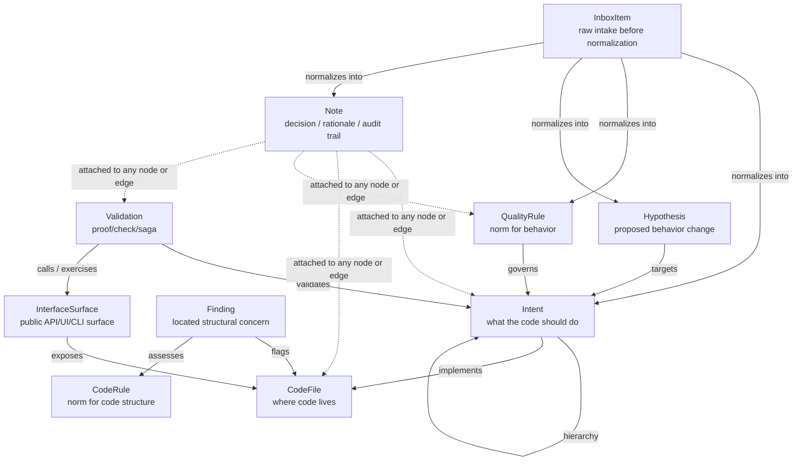
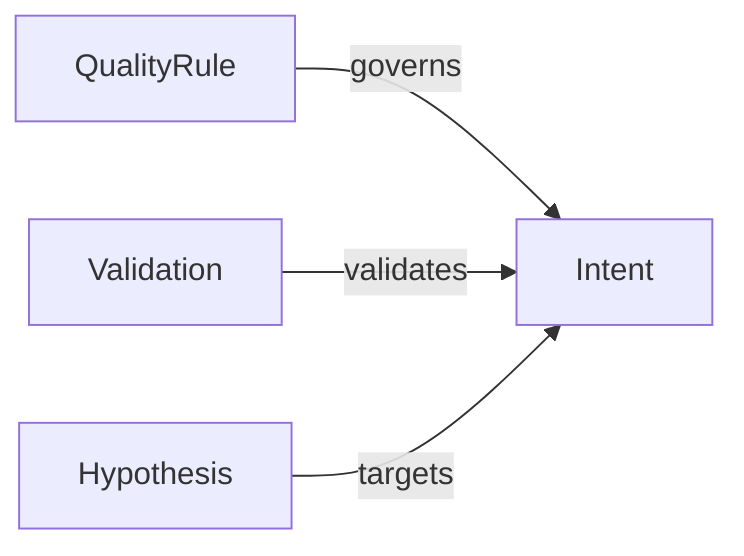
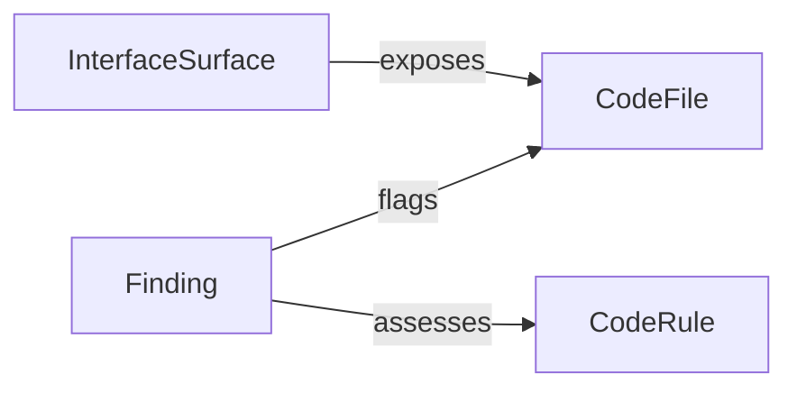
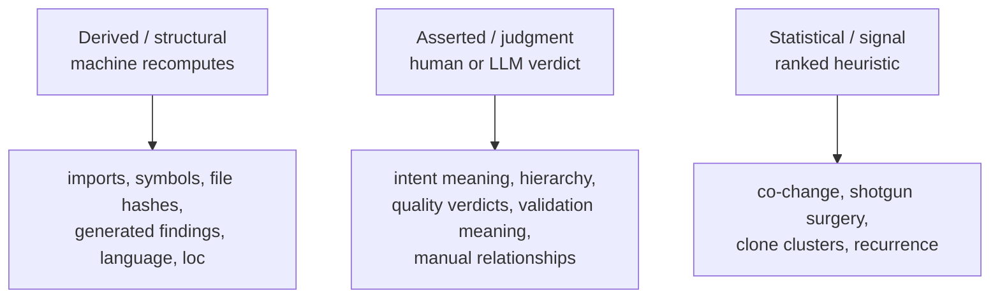
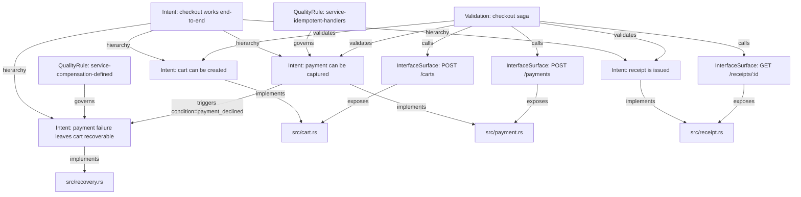
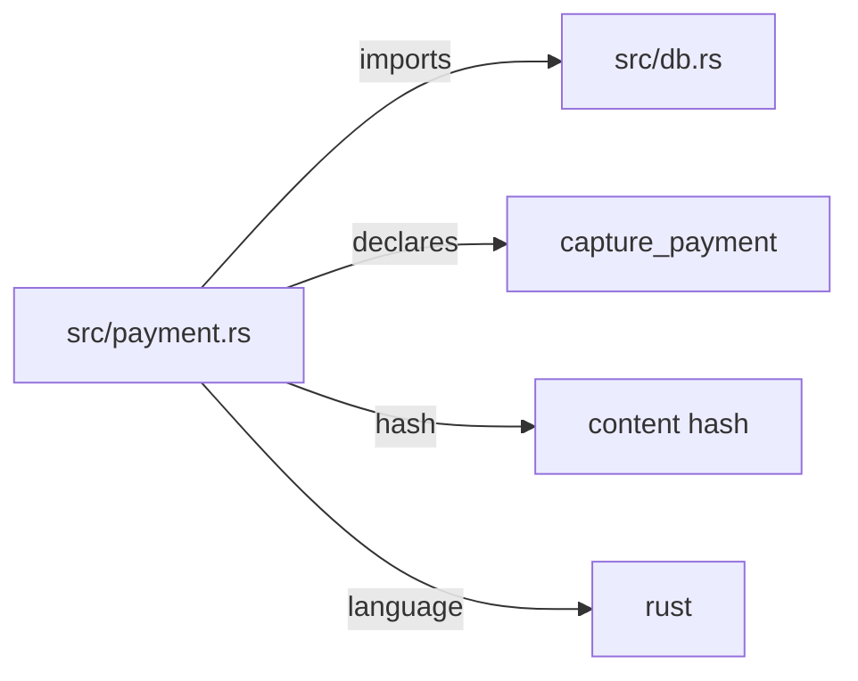
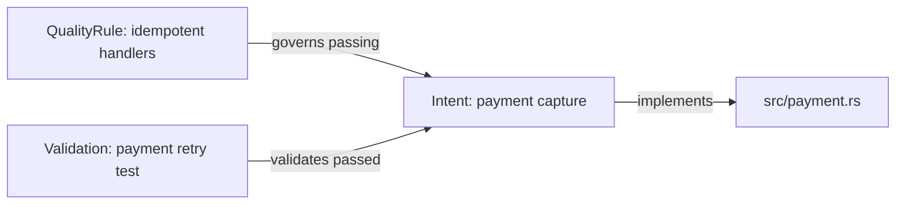
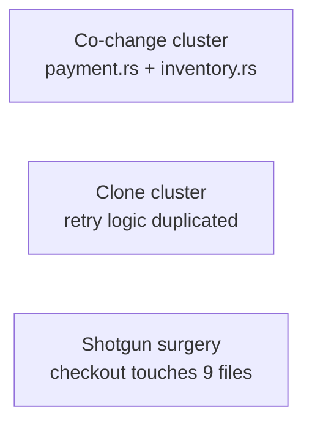

# loom v2 scratchpad consolidation

This file is the staging area before writing the real docs. It intentionally consolidates `design.md` plus working discussion notes so design ideas are not lost while the model is still moving.

---

# loom v2 — Design

**Status:** CONCEPT-LOCKED — all §10 forks settled (provisional, reversible). The doc is the
authoritative v2 architecture; code follows ring by ring. The earlier loom (`../../loom`) is a
**read-only reference oracle** — consult it for *how* working mechanisms behave (tree-sitter
extraction, sync ripple edge cases, SQL/locking patterns, saga HTTP execution). We re-derive the
*code* clean; we never copy it. Carrying v1 code would carry v1's accumulated conventions and
coupling.
**Relationship to v1:** greenfield rewrite — the old loom is the read-only reference oracle
described above; we re-derive clean, never copy.

---

## 1. What loom is

loom maintains a **falsifiable graph of what a codebase is supposed to do, where that lives, and
how it is proven** — so an LLM can understand and safely evolve a codebase across a long horizon.
The model supplies judgment and evidence; loom supplies durable memory, queues, staleness,
coverage, and integrity gates. Every command's output is the prompt for the LLM's next decision.

The v1 lesson that defines v2: loom's value is **truth that doesn't rot and work that is honestly
ranked**. v1 proved the substrate (extraction, persistence, sync) but tangled three different
*kinds of truth* into one obligation surface, producing an 18,000-item "debt" wall that was 98%
advisory noise. v2 separates them from the foundation.

---

## 2. The spine: three truth-class planes

Every fact in the graph belongs to exactly one **plane**, defined by *how its truth is
established*. This is the organizing principle of the whole system — schema, CLI, maturity,
teaching all derive from it.

| plane | truth-class | who establishes it | command | gates? |
|---|---|---|---|---|
| **Structural** | `derived` | the machine (extraction) | `loom sync` recomputes | feeds gates; never itself queued |
| **Judgment** | `asserted` | a human/LLM verdict or design decision | `loom next` routes the stale residue | the ONLY required-work queue |
| **Signal** | `statistical` | a heuristic over history/structure | `loom debt` ranked feed | never gates; advisory only |

**Determinism boundary = truth-class boundary:**
- `derived` is **reproducible** — wipe it, re-run sync, get a byte-identical result. Golden-testable.
- `asserted` is **persisted until invalidated** — a pinned fact with evidence; sync re-opens it precisely when something it depended on changes.
- `statistical` is **never stored** — computed on demand, ranked, presented as a feed, never an obligation row.

The three rules that fall out, and must hold everywhere:
1. **Statistical never gates and never enters required debt.** It is a feed (`loom debt`), full stop.
2. **Derived is never queued for judgment.** Sync owns its status; a human never "inspects" an import.
3. **Absence is the default.** A pair with no relationship has no row. "Independent" is a rare, *evidence-bearing* judgment, not a checkbox to fill for every pair.

---

## 3. The loop

```
loom sync     recompute the structural plane (deterministic); re-open only the asserted
              facts whose dependencies changed.
loom next     the asserted residue: stale verdicts, broken groundings, unbuilt intents.
              Never the grid. Never a co-change instance.
loom debt     ranked statistical clusters — the compression layer. Confirm one → it becomes
              an asserted edge / work item; dismiss → a decision note. Both remove it.
loom status   where you stand (maturity) + the single next move (compass).
```

---

## 4. Data model

### Nodes — cornerstones and their supporting families

Two **cornerstone** nodes anchor the graph, each with a family of **supporting nodes** that
carry the follow-up concerns their question raises (see §4d for the full rationale):

- **`Intent`** — what the code should do. The atomic "what." Family:
  `QualityRule` (compliance norms: security, performance, defect, style), `Validation` (proofs:
  test, assertion, benchmark, saga), `Hypothesis` (proposed changes — milestone 2).
- **`CodeFile`** — where the code lives. The "where." Family:
  `CodeRule` (structural norms: size, complexity, safety), `Finding` (occurrences at a location —
  derived truth-class, §4d sub-fork), `InterfaceSurface` (public surfaces — milestone 2).

Auxiliary nodes (not cornerstone-anchored): `Note` (audit-trail text on any target),
`InboxItem` (un-decomposed intake). These are cross-cutting, not family members.

**The edge kinds are named after the family's role**, not after a vague verb: `governs` from the
quality-rule family, `validates` from the validation family, `flags`/`assesses` from the
finding/code-rule family. The `edge_kind_registry` (§4) enforces that each kind's endpoints match
its family's node types — which is exactly the type-safety the unified edge model needs.

### Edges — LOCKED (A) unified typed edge table

v1 used **nine separate edge tables** (hierarchy, implements, governs, validates, relates_to,
targets, serves, journeys, calls). That gave per-endpoint FK integrity but scattered the
truth-class logic across nine places and made "every edge has a truth_class" a cross-cutting
patch rather than a column.

Two candidate models for v2:

- **(A) Unified typed edge table.** One `edge(from, to, kind, truth_class, status, criterion,
  evidence, confidence, …)`. Honors the "uniform A —{kind}{status}— B" instinct; truth_class is
  one column, not nine patches; new edge kinds are data, not schema. Cost: endpoint types are not
  FK-enforced per kind (a `governs` edge's `from` must be a rule — enforced in code, not schema).
- **(B) Typed edge tables (v1 shape).** Keep per-kind tables; add `truth_class` to each. FK
  integrity per endpoint; query-planner clarity. Cost: the truth-class spine is replicated nine
  times; adding a kind is a migration.

**Assistant recommendation: (A) unified, with a small typed-endpoint check in code.** The whole
v2 thesis is "truth-class is the organizing axis" — it should be one column the router reads, not
nine. The FK loss is recoverable with a cheap validation layer. **Locked: (A) — see §10.**

**Worked shapes, so the call is concrete:**

```sql
-- (A) Unified. One edge table + one facet table that serves nodes AND edges.
CREATE TABLE edge (
  id          TEXT PRIMARY KEY,
  from_id     TEXT NOT NULL,
  to_id       TEXT NOT NULL,
  kind        TEXT NOT NULL,   -- hierarchy|implements|governs|validates|relates|triggers|sequence|flags|assesses
  truth_class TEXT NOT NULL,   -- derived | asserted
  status      TEXT NOT NULL DEFAULT 'uninspected',
  criterion   TEXT NOT NULL DEFAULT '',
  evidence    TEXT NOT NULL DEFAULT '',
  confidence  REAL NOT NULL DEFAULT 0,
  created_at  TEXT NOT NULL,
  inspected_by TEXT NOT NULL DEFAULT ''
);
CREATE INDEX idx_edge_truth   ON edge(truth_class, status);  -- the router's hot path
CREATE INDEX idx_edge_kind    ON edge(kind, status);
CREATE INDEX idx_edge_from    ON edge(from_id, kind);
CREATE INDEX idx_edge_to      ON edge(to_id, kind);
-- endpoint typing enforced in code by an edge_kind_registry:
--   kind -> (from_node_type, to_node_type, truth_class, allowed_status[])
```

Under (A), "the asserted residue `loom next` routes" is ONE indexed query:
`SELECT * FROM edge WHERE truth_class='asserted' AND status IN ('uninspected','needs_reverification')`.
Under (B) it is a 9-table UNION. (A) is why concern 1 and concern 2 get simple: facets and
reactions are just more rows in the same two tables.

The cost is real and worth naming: a `governs` edge's `from` must be a `QualityRule` and `to` an
`Intent`. SQLite FKs can't express "depends on kind". So a write-time check reads the
`edge_kind_registry` and rejects a mistyped endpoint — the same guarantee, in code instead of DDL,
plus a `loom doctor` audit that re-validates every edge's endpoints against the registry.


### `truth_class` is a stored column from day one

Greenfield has no migration cost, so we do NOT repeat v1's "derived in code" stopgap. Every edge
row carries `truth_class` explicitly, set at write time by the plane that owns it.

### Provenance: `depends_on` — LOCKED (column in, single-hop until traversal lands)

The precise-invalidation mechanism (an asserted edge records the nodes/edges/locators/scopes it
relied on, so sync re-opens it only when one is implicated). Powerful but only pays off once
multi-hop LLM traversal exists. **Recommendation: design the column in, leave it single-hop
(endpoints only) until the traversal layer lands.** **Locked: column in, single-hop — see §10.**

---

## 4b. Facets: properties & tags — the index layer — LOCKED (canonical registry + `loom find --tag --where`)

The graph is also a **code-intelligence index**: an LLM must be able to *find what it needs* by
attribute, not just by traversing. That requires facets to be **canonical**, uniform across
nodes and edges, and indexed.

- **Property** = a typed `key=value` attribute drawn from a **registered property schema** (key,
  value-type, allowed values, meaning). One canonical key per concept — never free-form, because
  free-form drifts (`auth` / `authn` / `authentication`) and a drifted index is useless. Used for
  *filtering*: `visibility=user_visible`, `aspect=sad`, `layer=domain`, `language=rust`.
- **Tag** = a membership label from a **registered vocabulary** (term + definition), many-to-many.
  Used for *grouping/discovery*: "the auth cluster", "every security-boundary edge".
- **Uniform on nodes AND edges.** Same facet mechanism both places — a `triggers` edge can carry
  `condition=auth-failure` and tag `security`, just as an intent carries `visibility` and `auth`.

**The unifying insight: facets have a truth-class too.**
- `derived` facets are recomputed by sync: a codefile's `language`, `loc`, `symbol_count`.
- `asserted` facets are pinned judgments: `visibility`, `layer`, `aspect`, tags.
This makes the index honest — a derived facet can never be stale-but-trusted, and an asserted
facet carries provenance.

**LLM-facing surface:** `loom schema` prints the registry (every property key + tag + meaning);
`loom find --tag auth --where visibility=user_visible` returns a precise set via `(key,value)` and
(tag,target)` indexes. **Locked: canonical registry + `loom find --tag --where` — see §10.**

## 4c. Behavior taxonomy — capabilities, flows, and reactions — LOCKED (edge-native reactions, capability = intent + aspect)

Today we have two points — `intent` (atomic) and `saga` (flow) — and feel the missing middle.
The clean spine is **what → how it composes → how it's proven**:

1. **WHAT — the Intent (the only atomic *what*).** A "capability" is **not a new node** — it is an
   intent at capability altitude (a user-visible component/feature whose criterion is "the system
   can do X"). The `aspect` facet differentiates the kinds of behavior:
   `capability | happy | sad | fallback | edge_case | invariant`.
2. **COMPOSES — relationships between intents, expressed as edges (in the unified table):**
   - **Sequence** (`saga`/flow): ordered steps — "user does A then B then C." A journey.
   - **Reaction** (`trigger`/when-then): a condition/event and the response intents it requires —
     "if X happens, then Y and Z must hold." This is the shape of error handling, security rules,
     business rules, invariants — your "if something happens it should do this and this."
3. **PROVEN — a Validation** exercises an intent or a composition (unit/assertion test, saga run,
   scenario run).

So *sagas and reactions are both compositions* — sagas are the sequential kind, reactions are the
conditional kind. That unifies them and keeps the node count small.

**The fork — how to model a reaction:**
- **(i) Edge-native.** A `triggers` edge from the triggering context to each required-response
  intent, carrying a `condition` property and a shared `scenario` tag to group the set. No new node.
  Maximally streamlined; ideal for "on X, do Y."
- **(ii) Scenario node.** A first-class `{ given, when, then[] }` spec referencing intents, proven
  by a validation. More structure for rich multi-condition contracts; one more node type.

**Assistant recommendation:** start **edge-native (i)** — it rides the unified edge model and
keeps v2 small — and promote a reaction to a Scenario node only when contracts get genuinely rich
(multiple conditions, ordered responses). Capability = intent + `aspect`, never a new node. **Locked: edge-native — see §10.**

## 4d. Supporting nodes — the cornerstone families — LOCKED (families with norm/occurrence split; Finding sub-fork open, §10 item 8)

"Govern" is too broad: one edge carrying security, performance, defects, structure, and
observability flattens fundamentally different *concerns* into one undifferentiated relation —
a defect verdict and a performance verdict have nothing in common except the word "govern." The
fix is **not** to add attributes to the govern edge; it is to recognize that each cornerstone
node has a **family of supporting nodes**, and the edge kinds are named after the family.

### The principle

Each cornerstone node answers a question. Its supporting nodes answer the *follow-up* concerns
that question raises:

| cornerstone | question | supporting-node family | the edge kind |
|---|---|---|---|
| `Intent` | what should the code do? | `QualityRule` (compliance: security, performance, defect, style) | `governs` |
| `Intent` | ↑ | `Validation` (proof: test, assertion, benchmark, manual_check) | `validates` |
| `Intent` | ↑ | `Hypothesis` (a proposed change to this behavior) | `targets` |
| `CodeFile` | where does it live? | `Finding` (a code-quality concern at a specific location) + `CodeRule` (the reusable norm it's an occurrence of) | `flags` + `assesses` |
| `CodeFile` | ↑ | `InterfaceSurface` (a public surface this file exposes) | `exposes` |

So "govern" is not one edge — it is the **`governs` edge from the `QualityRule` family**. A
security rule, a performance rule, and a defect rule are three distinct `QualityRule` nodes, each
linked to an `Intent` by its own `governs` edge with its own status. The `QualityRule` node
carries the *concern* (its `category` property: `security | performance | defect | style | robustness`);
the edge carries the *verdict* (passing/failing/independent) and the *evidence*. This separates
the norm from the measurement — they were conflated in v1 under one edge.

### Why families, not attributes on the edge

- **A rule is a reusable norm, not a per-edge property.** "ISO 5055 dead-code detection" is one
  rule; it governs many intents. Storing it as an attribute on each `governs` edge duplicates the
  rule and loses its identity. A `QualityRule` node is the single source of the norm; the edge is
  the verdict against it.
- **A rule has its own lifecycle** (seeded from a pack, refined, retired). Edges don't.
- **A rule carries its own metadata** (detection logic, severity, effort class). Edges carry
  evidence; rules carry *what to look for*.
- **The same applies to every family.** A `Validation` is a reusable proof (runnable, re-runnable);
  the `validates` edge is the link to an intent. A `Finding` is a concern at a location; the
  `flags` edge links it to the file it's about, and `assesses` links it to the `CodeRule` it's an
  occurrence of.

### The cornerstone families (settled for MVP, extensible)

**Intent family** (what should the code do, and what holds it to a standard):
- `QualityRule` — a norm the code must satisfy. Property `category ∈ {security, performance,
  defect, style, robustness, …}`. Seeded from packs or authored. Edge `governs : rule → intent`.
- `Validation` — a proof that behavior holds. Property `type ∈ {test, assertion, benchmark,
  manual_check, saga}`. Carries a `command`. Edge `validates : validation → intent`.
- `Hypothesis` (milestone 2) — a proposed change to an intent's behavior, proven before adoption.
  Edge `targets : hypothesis → intent`.

**CodeFile family** (where it lives, and what concerns its structure raises):

The Intent family splits norm (`QualityRule`) from verdict (the `governs` edge). The CodeFile
family needs the **same split** — a reusable standard is not the same thing as an occurrence at
a location:

- **`CodeRule`** — a reusable structural norm a file (or symbol) must satisfy. Property
  `category ∈ {size, complexity, style, safety, …}`. Seeded from packs or authored. Examples:
  "a file should not exceed N lines", "no `panic!`/`unwrap` in production code", "a function with
  >M branch count should split." A `CodeRule` is to a `CodeFile` what a `QualityRule` is to an
  `Intent` — the norm; not the measurement.
- **`Finding`** — an occurrence: a specific location (file + optional symbol) where a `CodeRule`
  is **violated or satisfied**. Truth-class `derived` (recomputed by sync from the file's own
  content). Edge `flags : finding → codefile` (the location) + edge `assesses : finding → coderule`
  (which rule it's an occurrence of). Property `kind ∈ {oversized_file, complex_symbol,
  tangled_file, panic_marker, …}`. This is the **structural signal made a graph citizen** —
  physical code-quality concerns live as nodes so they can be queried, tagged, and adjudicated
  into work (a confirmed finding becomes a `needs_change` intent).

The split is what makes "what code-quality concerns exist in this file?" a graph query:
`CodeRule` is the standard, `Finding` is the occurrence, `flags` locates it, `assesses` names the
  norm it's an occurrence of. Without `CodeRule`, every `Finding` would carry its threshold and
  logic inline — duplicating the norm and losing its identity (the exact problem the advisory
  flagged: no reusable standard for file-level concerns).

- **`InterfaceSurface`** (milestone 2) — a public surface a file exposes. Edge `exposes :
  interface → codefile`; calls link via `calls : validation → interface`.

### What this changes from v1

v1 had `governs`, `validates`, `targets`, `serves`, `journeys`, `calls` as edge kinds but the
supporting nodes (`QualityRule`, `Validation`, `Hypothesis`, `Persona`, `InterfaceSurface`) were
treated as a flat secondary list, not as **families anchored to a cornerstone**. v2 formalizes the
anchor: every supporting node belongs to exactly one cornerstone's family, and its edge kinds are
named for the family's role (`governs` from the quality-rule family, `validates` from the
validation family, `flags`/`assesses` from the finding/code-rule family). The
`edge_kind_registry` enforces the endpoint types per kind — exactly the type-safety the unified
edge model (§4) needs.

### The norm/occurrence split, stated once for both families

| cornerstone | norm node | occurrence node | locating edge | norm-naming edge |
|---|---|---|---|---|
| `Intent` | `QualityRule` | the `governs` verdict (on the edge) | `governs : rule → intent` | — (the rule *is* the norm) |
| `CodeFile` | `CodeRule` | `Finding` | `flags : finding → codefile` | `assesses : finding → coderule` |

For the Intent family, the "occurrence" is the verdict itself — the `governs` edge *is* the
measurement (passing/failing/independent against the rule). For the CodeFile family, the
occurrence is a `Finding` node (it has a location and a kind), linked to both its file (`flags`)
and its rule (`assesses`). The asymmetry is real: Intent verdicts are one-hop (rule→intent), while
file findings are two-hop (finding→file + finding→rule). The unified edge model handles both
naturally — they're just different edge kinds with different endpoint types in the registry.

### Open sub-fork: Finding as a derived node vs a computed view ◻ DECIDE

v1 computed smells as ephemeral query results, never stored — and that was correct for the
statistical plane (co-change, shotgun, clone). But the *structural* findings (oversized_file,
complex_symbol, tangled_file, panic_marker) are different: they are **deterministic** (derived
from the file's own content, not from git history) and they **have a specific location** (file +
symbol) that deserves a stable identity for querying and adjudication.

- **(α) Finding as a derived node** — a `derived` truth-class node, recomputed by sync, queryable
  by `kind` and `file`, adjudicable into a `needs_change` intent when confirmed. The `flags` and
  `assesses` edges link it. This makes "what code-quality concerns exist in this file?" a graph
  query, not a recompute.
- **(β) Finding as a computed view (v1 shape)** — never stored, recomputed on demand. Simpler
  schema; but you can't tag, query, or track a structural finding's lifecycle through the graph.

**Assistant recommendation: (α) node for structural findings, (β) view for statistical signals.**
Structural findings are derived (deterministic, located, recomputable) and deserve node identity;
statistical signals (co-change, shotgun, clone) are scores, never nodes — they stay the `loom debt`
feed. This splits cleanly along the truth-class boundary: structural = derived node, statistical =
computed view. **Open: choose α or β in §10 item 8 — the one remaining decision.**

## 5. The maturity ladder

`Seeded → Realized → Proven → Hardened → Production-ready → Excellent`, each a rung in a vector
(not a scalar), with the lowest unmet rung as the routing focus.

The v2 fix baked in from the start: **Excellent gates on triaged statistical clusters, not raw
instance count.** Excellent is `Met` when every cluster above an impact threshold is adjudicated
(confirmed → work, or dismissed → decision note), `NotApplicable` when none cross it. No 18k cliff.

`Hardened` gates on the **asserted coupling residue** (stale/uninspected asserted relationships),
never on a grid denominator.

---

## 6. Invariants (the test contract)

These are the properties the test suite must guard from the first commit:

- **INV-1 — No grid materialization.** Adding N unrelated intents creates O(N) hierarchy edges, not O(N²) relationship rows.
- **INV-2 — Derived rebuildable.** Delete the structural plane, sync, get a byte-identical set.
- **INV-3 — Statistical never required.** No statistical signal is ever a stored edge, a gate input, or a `loom next` required item.
- **INV-4 — Absence is default.** `independent` rows exist only with non-empty evidence.
- **INV-5 — Class-partitioned authorship.** Derived status is written only by sync; asserted only by a verdict path. No function writes both.

---

## 7. Greenfield principles

- **Reference, never port.** Read `../../loom` to learn behavior; write fresh code. No copy-paste.
- **Rust, same proven crates.** `clap`, `rusqlite` (bundled), `tree-sitter` (+ rust/py/go/ts/js), `reqwest` (rustls, blocking), `serde`. This keeps `../../loom` a *directly usable* reference and re-uses battle-tested dependencies.
- **Docs are first-class.** Every module opens with a doc comment stating its plane and contract. A `docs/` tree explains the concept; the design doc and the code never drift (a check enforces it, as v1's wiki did).
- **Truth-class native.** The router reads `truth_class`; nothing infers it ad hoc.
- **Smaller than v1.** v2 is mostly subtraction — if a v1 concept doesn't serve the three planes, it does not come across.

---

## 8. What comes from v1, and how

| v1 mechanism | v2 treatment | reference value |
|---|---|---|
| tree-sitter extraction (`repo.rs`, `ts_imports.rs`) | re-derive clean; same crates | HIGH — the language quirks are hard-won |
| SQLite store + cross-process flock (`db/sqlite*`) | re-derive clean; same `rusqlite`/`fs2` | HIGH — WAL + locking patterns |
| sync ripple (`commands/sync.rs`) | re-derive on the three-plane model | HIGH — staleness edge cases |
| sagas / HTTP proofs (`saga/`) | port the *spec format*; rebuild the runner if the proof plane is in scope | MEDIUM |
| maturity/compass/stats | rebuild clean (this is what was tangled) | LOW — reference the gate *intent*, not the code |
| guide/teaching (130KB `guide.rs`) | rebuild minimal around three planes | LOW — v1's is the cautionary tale |

---

## 9. Build sequencing — LOCKED (rings 1–7 are the MVP)

The goal bar is: builds, tests pass, and the binary can **drive a real codebase** (dogfood on
itself). We must agree the minimum surface that clears that bar. Candidate MVP ring:

1. **Core model + store:** Intent/CodeFile nodes, the unified edge table, SQLite, `init`/`import`.
2. **Structural plane:** codefile registration, tree-sitter extraction, grounding (IMPLEMENTS), `sync` recompute.
3. **Judgment plane:** intent lifecycle, hierarchy, the `next` queue over asserted residue.
4. **Maturity + compass:** `status`, the ladder, the single-next-move router.
5. **Quality plane:** rules, GOVERNS verdicts.
6. **Signal plane:** smells computation, `loom debt` ranked feed.
7. **Coverage + export/import + dogfood.**

Deferred rings (only if we decide they're in the "fully working" bar): sagas, personas,
hypotheses, federation, wiki, vocab/layers.

**Recommendation: rings 1–7 are the MVP that clears "dogfoodable."** Sagas/personas/etc. are a
second milestone. **Locked: rings 1–7 — see §10.**

---

## 10. Decisions — LOCKED (provisional, reversible)

1. **Edge model → (A) Unified typed edge table** + one `facet` table for nodes and edges. §4.
2. **MVP scope → rings 1–7** (core model → structural → judgment → maturity → quality → signal →
   coverage/export). Sagas/personas/hypotheses/federation/wiki = milestone 2.
3. **`depends_on` → column designed in, single-hop (endpoints only)** until a traversal layer lands.
4. **Language → Rust**, same proven crates (clap, rusqlite bundled, tree-sitter, reqwest rustls,
   serde, fs2) — keeps `../../loom` a directly usable reference oracle.
5. **Identity → binary stays `loom`**, built in `loom_new`, **fresh graph** (no v1 `loom.graph.json`
   import in MVP — v1 modeled the old concept; a v1→v2 importer is a later, optional bridge).
6. **Reaction model → edge-native (i)** (`triggers` edges + `condition` property + `scenario` tag);
   promote to a Scenario node only if contracts get rich.
7. **Facets → canonical registry** (property keys + tags, each with a truth-class) queried via
   `loom find --tag <t> --where <key>=<val>`.
8. **Finding + CodeRule → ◻ OPEN.** (α) structural findings as derived nodes + CodeRule as the
   reusable norm; statistical signals always computed views. Or (β) *all* findings (structural
   AND statistical) as computed views, never stored as nodes. §4d. *(assistant: α — awaiting user
   decision)*
9. **Non-negotiable deferred rings for v1 → none** (clean MVP first; milestone 2 adds the rest).

---

*Design doc awaiting user decision on item 8. Once settled, scaffold and build ring by ring,
each green before the next. Override any locked decision and I adapt — the cost is bounded
because we're at the start.*


---

# Scratchpad addition — v2 graph mental picture

Status: exploratory consolidation. This section is not yet the real design doc; it captures the working model from discussion so it can be promoted, rewritten, or rejected deliberately.

## One-sentence picture

v2 is a typed evidence graph with two cornerstone nodes — `Intent` and `CodeFile` — and every advanced capability attaches as a family around one of those cornerstones. The truth-class split does not remove capability; it prevents derived facts, human judgments, and statistical hints from being routed through the same work queue.

## The graph shape



## Cornerstones

### `Intent`

`Intent` is the behavioral atom: what the code should do.

Examples:

- `user can reset password`
- `checkout reserves inventory before payment capture`
- `sync invalidates stale verdicts after source changes`
- `CLI returns machine-readable JSON for agent drivers`
- `mobile app survives offline queue replay`

Typical facets:

```text
visibility = user_visible | internal
aspect     = capability | happy | sad | fallback | edge_case | invariant
layer      = presentation | application | domain | storage
domain     = auth | billing | sync | graph
tags       = retry, auth, checkout, privacy
```

### `CodeFile`

`CodeFile` is where code lives.

Examples:

- `src/commands/sync.rs`
- `src/db/schema.rs`
- `src/saga/runner.rs`
- `app/screens/Checkout.tsx`
- `Dockerfile`

Machine-derived facets can include:

```text
language = rust
loc = 420
symbols = [...]
imports = [...]
content_hash = ...
```

The primary bridge is:

```text
Intent --implements--> CodeFile
```

## Families around `Intent`



### `QualityRule`

A reusable behavioral norm.

Examples:

- external input is validated
- service endpoint is authenticated
- view has loading/empty/error states
- performance budget is proven
- no hardcoded secrets
- workflow has compensation path

The rule is not the verdict. The verdict lives on the edge:

```text
QualityRule --governs{status, criterion, evidence, confidence}--> Intent
```

### `Validation`

A proof.

Examples:

- unit test
- integration test
- benchmark
- manual check
- saga
- scenario run
- UI visual confirmation
- Docker build smoke
- API contract test

```text
Validation --validates--> Intent
```

### `Hypothesis`

A proposed change before it becomes real work.

Examples:

- sync queue is slow because graph stats recompute too broadly
- users abandon onboarding because seed questions are too abstract
- checkout retry logic is duplicated across handlers

```text
Hypothesis --targets--> Intent
```

If supported, it spawns or updates real intents. If refuted, it dies as a recorded decision.

## Families around `CodeFile`



### `CodeRule`

A reusable structural norm.

Examples:

- file should not exceed 500 lines
- function should not exceed complexity 12
- production code should not use panic/unwrap at a boundary
- generated files should not count toward ownership debt
- public handler should be attached to an interface surface

### `Finding`

A located occurrence.

```text
Finding: oversized_file
  flags -> src/commands/guide.rs
  assesses -> CodeRule: max-file-size

Finding: complex_symbol
  flags -> src/db/queries/stats.rs:build_ladder
  assesses -> CodeRule: max-cyclomatic-complexity

Finding: panic_marker
  flags -> src/server/auth.rs:require_user
  assesses -> CodeRule: no-panic-at-boundary
```

The split is:

```text
CodeRule = reusable standard
Finding  = specific occurrence
```

### `InterfaceSurface`

A public seam.

Examples:

- `POST /checkout`
- `GET /users/:id`
- CLI command `loom sync`
- React route `/settings/billing`
- exported SDK method `client.payments.capture`
- message topic `invoice.created`

```text
InterfaceSurface --exposes--> CodeFile
Validation --calls/exercises--> InterfaceSurface
```

## Unified edge shape

```text
edge {
  from_id
  to_id
  kind
  truth_class
  status
  criterion
  evidence
  confidence
  depends_on
  facets
}
```

Representative edge kinds:

```text
hierarchy   Intent -> Intent
implements  Intent -> CodeFile
governs     QualityRule -> Intent
validates   Validation -> Intent
targets     Hypothesis -> Intent
flags       Finding -> CodeFile
assesses    Finding -> CodeRule
exposes     InterfaceSurface -> CodeFile
sequence    Intent -> Intent
triggers    Intent -> Intent
calls       Validation -> InterfaceSurface
relates     Intent -> Intent
```

The `edge_kind_registry` is the type system for edges. It says which endpoints are legal, which truth-class owns the edge, and which statuses are valid.

Example:

```text
kind: governs
from: QualityRule
to: Intent
truth_class: asserted
allowed_status: uninspected | passing | failing | independent | needs_reverification
```

```text
kind: flags
from: Finding
to: CodeFile
truth_class: derived
allowed_status: current
```

## Truth classes

Every graph fact belongs to a plane by how it becomes true.



### Derived

Machine-recomputed facts.

Examples:

- file content hash
- imports
- symbol list
- loc
- generated language
- structural findings if `Finding` is a derived node
- file-level coupling projections

Derived facts are not human work. They are recalculated.

### Asserted

Judgment-bearing facts.

Examples:

- this file implements this intent
- this quality rule passes for this intent
- these two intents are coupled through event topic X
- this validation proves this behavior
- this smell is intentional; decision note attached

Asserted facts can stale. These are what `loom next` routes.

### Statistical

Advisory signals.

Examples:

- co-change clusters
- shotgun surgery suggestions
- clone clusters
- recurring trouble spots
- suspicious proof locality

Statistical facts do not become obligations by existing. They become real work only when confirmed.

## Example feature graph: checkout



This graph can answer:

- What code implements checkout?
- Which endpoint exposes payment capture?
- Which saga proves the journey?
- Does payment capture have idempotency coverage?
- What happens when payment fails?
- Which files changed under checkout since the last proof?
- Which assertions stale after `src/payment.rs` changes?
- Which statistical debt clusters touch checkout?

## Layered mental model

v2 has three overlaid graphs.

### Structural map

Machine-maintained.



### Semantic/judgment map

Human/agent-maintained.



### Signal map

Computed feed.



## Capability preservation rule

Do not pitch v2 as smaller loom. Pitch it as better-typed loom.

| Capability | v2 home |
|---|---|
| Sagas | `Validation` family; may create `sequence` edges between intents and `calls` edges to `InterfaceSurface` |
| Hypotheses | `Hypothesis --targets--> Intent`; adopted into planned intents only after proof |
| Personas | Facet or supporting node attached to user-visible intents/journeys |
| Federation | Graph identity + delegated `CodeFile`/Intent subtrees; parent observes child exports |
| Wiki | Projection/report over graph + notes, not a competing source of truth |
| Vocab | Facets/tags on nodes and edges via canonical registry |
| Layers | `layer` facet on intents/code surfaces; layer-order rule produces findings/verdicts |
| Smells/debt | `loom debt` statistical feed; confirmed statistical clusters become `Hypothesis`, `needs_change Intent`, manual edge, or decision note. Create `Finding` only for located deterministic structural facts. |
| UI flows | `Intent` hierarchy + `InterfaceSurface` + `Validation`/manual visual checks |
| Reactions/error handling | `triggers` edges with `condition` facet |
| API endpoints | `InterfaceSurface --exposes--> CodeFile`; validations call them |
| Quality | `QualityRule --governs--> Intent` |
| Code structure | `CodeRule`, `Finding`, `flags`, `assesses` |

## Compact schema sketch

```text
Node
  id
  type:
    Intent
    CodeFile
    QualityRule
    Validation
    Hypothesis
    CodeRule
    Finding
    InterfaceSurface
    Note
    InboxItem
  name
  description
  lifecycle/status fields
  created_at
  updated_at

Edge
  id
  from_id
  to_id
  kind:
    hierarchy
    implements
    governs
    validates
    targets
    flags
    assesses
    exposes
    sequence
    triggers
    calls
    relates
  truth_class:
    derived
    asserted
  status:
    current
    uninspected
    passing
    failing
    independent
    needs_reverification
    blocked
  criterion
  evidence
  confidence
  depends_on
  inspected_by
  created_at
  updated_at

Facet
  target_id
  target_type: node | edge
  key
  value
  truth_class
  provenance

Tag
  target_id
  term

Registry tables
  node_type_registry
  edge_kind_registry
  property_schema_registry
  tag_vocabulary
  scope_kind_registry
```

Statistical signals may be computed views rather than stored edges:

```text
DebtSignal / DebtCluster  [computed]
  kind: cochange | clone | shotgun | recurrence | proof_locality
  evidence
  impact
  suggested_confirmation
  suggested_dismissal
```

If confirmed, they become real graph facts:

```text
confirmed cochange cluster
  -> Hypothesis
  -> manual relates edge
  -> needs_change Intent
  -> Note dismissing it
```


---

# Scratchpad addition — open Q&A

Status: discussion notes. These answer current design questions and should be promoted into the real docs once the vocabulary settles.

## Q: Do attributes/properties for nodes and edges use enums?

Yes, but not every property is hard-coded as a Rust enum.

The model should have three levels of constraint:

1. **Core schema enums** — compiled, stable, and used by routing/invariants.
2. **Registry-backed enums** — stored in the graph, user/project extensible, validated at write time.
3. **Open values** — strings/numbers/JSON only where the system must preserve external identity or unbounded evidence.

### Core schema enums

These should be Rust enums and SQLite `CHECK` constraints from day one, with one important split: **stored edge truth classes are only `derived | asserted`; `statistical` is a core enum for computed signal/debt records, not a persisted `edge.truth_class`.**

```text
NodeType =
  Intent | CodeFile | QualityRule | Validation | Hypothesis |
  CodeRule | Finding | InterfaceSurface | Note | InboxItem

EdgeTruthClass =
  derived | asserted

SignalTruthClass =
  statistical

InspectionStatus =
  current | uninspected | passing | failing | independent |
  needs_reverification | blocked

Lifecycle =
  planned | implemented | needs_change | deprecated

ValidationType =
  test | assertion | benchmark | manual_check | saga | scenario
```

Reason: these values drive queue routing, staleness, integrity checks, and command behavior. If they drift, loom lies. `statistical` stays typed so `DebtSignal`/`DebtCluster` code is explicit, but it is not a stored edge state because statistical signals are computed feeds, never obligation rows.

### Registry-backed enums

These are enum-like, but live in registry tables so the project can grow without a migration:

```text
edge_kind_registry
  kind
  from_node_type
  to_node_type
  edge_truth_class          # derived | asserted only
  allowed_statuses
  owner_role

property_schema_registry
  key
  value_type
  allowed_values
  applies_to
  truth_class
  description

tag_vocabulary
  term
  description

scope_kind_registry
  kind
  arg_schema
  fingerprint_contract
```

Examples:

```text
property visibility allowed_values = user_visible | internal | untriaged
property aspect allowed_values = capability | happy | sad | fallback | edge_case | invariant
property layer allowed_values = project-defined, then ordered by `loom layer order`
edge kind triggers = Intent -> Intent, asserted
edge kind exposes = InterfaceSurface -> CodeFile, derived/asserted depending source
```

Reason: these values need validation and discovery (`loom schema` should print them), but we should not need a source migration every time a project introduces `layer=adapter` or `tag=payments`.

### Open values

These stay open:

```text
criterion
evidence
reason
note text
file path
symbol locator
URL/path/method identity on InterfaceSurface
command string on Validation
confidence numeric
external IDs
```

Reason: these are evidence and external identity, not ontology.

### Rule

If a value affects routing, status transitions, or integrity: **core enum**.
If a value affects search/filtering/grouping and should be validated: **registry-backed enum/property**.
If a value is evidence or external identity: **open value**.

## Q: What phases must an LLM go through with loom so the codebase ends well structured, correct, optimized, and maintainable?

The companion loop should be a maturity ladder, not one giant checklist. Each phase leaves graph evidence behind.

### 0. Intake / restore

Goal: get to a valid graph session.

Actions:

```text
loom init / import / sync
loom status
loom detect
loom guide
```

Output:

- graph store exists
- export/import state known
- project type detected
- next phase chosen by compass

### 1. Seed meaning

Goal: capture what the codebase is supposed to do.

Actions:

- create top-level system/component intents
- record user-visible vs internal behavior
- add source docs/contracts where available
- capture unclear input as `InboxItem`, not memory

Output:

- intentional tree exists
- raw asks normalized into intents, rules, hypotheses, or notes
- no major product area is only in the LLM's head

### 2. Ground code

Goal: connect meaning to files.

Actions:

```text
loom codefile add ...
loom sync
loom edge implement ...
```

Output:

- codefiles registered
- imports/symbols/facts extracted
- implemented leaf intents point to files/locators
- unowned files are explicit coverage gaps or ignored with reasons

### 3. Realize missing behavior

Goal: planned/needs-change intents become real code.

Actions:

- pull `loom next` build items
- implement behavior
- run local proof
- `loom sync` after code changes

Output:

- planned leaves become implemented
- broken groundings fixed
- no scaffolds counted as done

### 4. Prove correctness

Goal: every important behavior has evidence.

Actions:

```text
loom validation add ...
loom validate ...
loom saga add/run ...       # when endpoint/user journey proof matters
```

Output:

- validations linked to intents
- runnable/manual proofs are passed, failed, or blocked with reasons
- user-visible flows get composition proof, not just unit proof

### 5. Measure quality

Goal: standards are explicit and verdict-bearing.

Actions:

```text
loom rule seed ...
loom next --mode quality
loom rule verdict ...
```

Output:

- quality rules govern relevant intents
- security/reliability/performance/UI/data/container concerns are measured
- independent means measured-not-applicable, not uninspected

### 6. Inspect relationships and architecture

Goal: important coupling is understood, intentional, and current.

Actions:

- inspect asserted relationship residue
- classify manual indirect wiring
- record reactions/triggers/sequences where behavior composes
- declare layer order when enough architecture is known

Output:

- stale asserted relationships refreshed
- indirect contracts are not invisible
- layering violations are surfaced or justified
- intent islands/tangles become explicit work or decisions

### 7. Optimize / harden via signal triage

Goal: improve structure and performance without turning every heuristic into guilt.

Actions:

```text
loom debt
confirm cluster -> Hypothesis / needs_change Intent / manual edge
dismiss cluster -> decision Note
```

Output:

- co-change/clone/shotgun/perf signals are triaged as clusters
- confirmed debt becomes real work
- dismissed debt has rationale
- statistical signals never become raw obligation piles

### 8. Align with the human/product owner

Goal: prevent a green graph from describing the wrong product.

Actions:

- use align queue for stale/high-churn user-visible intents
- confirm, update, retire, or add intents
- batch human-gated questions

Output:

- product meaning is re-confirmed after churn
- changed requirements stale downstream evidence honestly
- internal machinery is not repeatedly presented as product behavior

### 9. Export / audit / maintain

Goal: make the graph travel and keep future sessions safe.

Actions:

```text
loom status
loom coverage
loom doctor
loom export
loom export --check
```

Output:

- graph and code are in sync
- coverage gaps are closed or intentionally ignored
- integrity checks pass
- committed export is fresh
- next LLM can resume from the graph, not from chat history

### Phase invariant

Every phase must leave one of these durable artifacts:

- node
- edge
- facet/tag
- validation result
- quality verdict
- finding
- hypothesis ruling
- decision note
- export

If a phase only changes the LLM's memory, loom failed its purpose.

---

# Scratchpad addition — subgraphs, hierarchy, and reusable atomic intents

Status: discussion note. Keep if we agree hierarchy is a narrow decomposition tool, not the universal relationship edge.

## Position

Yes, keep hierarchy. But make it **boring and narrow**:

```text
hierarchy = semantic decomposition / coverage ownership
```

Do not use hierarchy for every relationship. Reuse, variants, conditions, sequences, code realization, and proof all need separate typed edges. This gives the LLM deterministic traversal while leaving the content human/cognitive.

## Intent subgraph

An "intent subgraph" is not a separate database graph. It is the neighborhood query around one intent:

```text
intent subtree
+ reusable required intents
+ variants/scenarios
+ triggers/reactions
+ implementing codefiles
+ validations/sagas
+ quality verdicts
+ interface surfaces
+ notes/decisions
+ relevant debt clusters
```

This is what an LLM reads when it asks "what does this behavior mean, where is it, how is it proven, and what is missing?"

## Hierarchy rule

Use hierarchy for **part-of decomposition**:

```text
System intent
  -> component/capability intent
    -> feature/behavior intent
      -> atomic leaf intent
```

Prefer one canonical hierarchy parent for coverage. If an atomic concept is reused by multiple higher-level intents, do **not** give it multiple hierarchy parents just to show reuse. Link reuse with typed relationship edges.

Reason: hierarchy powers roll-up, coverage, and "what is this made of?" If it also means reuse, prerequisite, variant, sequence, and cause/effect, it stops being deterministic.

## Typed edges beside hierarchy

Use these edge kinds for non-hierarchy semantics:

```text
requires     Intent -> Intent
  This behavior needs another behavior/capability to exist.

variant_of   Intent -> Intent
  This is a named variant of the parent behavior.

scenario_of  Intent -> Intent
  This is a concrete scenario/case for a capability.

triggers     Intent -> Intent
  When condition/event X happens, response Y must hold.

sequence     Intent -> Intent
  Step ordering inside a journey/saga.

implements   Intent -> CodeFile
  This behavior is realized at this code location.

validates    Validation -> Intent
  This proof checks this behavior.

governs      QualityRule -> Intent
  This rule/norm is measured against this behavior.
```

Names are provisional; the principle is not: typed relationships keep hierarchy clean.

## Atomic intent test

An atomic intent is worth a node when it has all three:

1. A falsifiable criterion.
2. Independent failure modes.
3. A plausible proof or code grounding.

Do not turn every noun into an intent.

Examples:

```text
bad atom:
  cookies

good atom:
  server issues an HttpOnly secure session cookie after successful login

bad atom:
  password

good atom:
  submitted password is verified against the stored password hash without exposing the hash

bad atom:
  browser remember

good atom:
  remember-me token restores a session after browser restart until revoked or expired
```

## Login example

Human ask:

```text
user can login and browser remember
```

Possible graph:

```text
Intent: user authentication works
  hierarchy -> Intent: user can log in with password
  hierarchy -> Intent: browser can remember the user
  hierarchy -> Intent: user can log out

Intent: user can log in with password
  requires -> Intent: submitted password verifies against stored password hash
  triggers(condition=valid_credentials) -> Intent: authenticated session is created

Intent: invalid password is rejected without session creation
  scenario_of -> Intent: user can log in with password

Intent: browser can remember the user
  requires -> Intent: server issues persistent remember-me token
  requires -> Intent: remember-me token restores session after browser restart
  triggers(condition=remember_me_checked) -> Intent: persistent token is set

Intent: expired remember-me token requires re-authentication
  scenario_of -> Intent: browser can remember the user

Intent: authenticated session is created
  implements -> src/auth/session.rs
  validates <- login_session_test

Intent: server issues persistent remember-me token
  implements -> src/auth/remember.rs
  governs <- QualityRule: token is HttpOnly/Secure/SameSite and rotated
```

Here, reusable atoms like "authenticated session is created" or "submitted password verifies against stored password hash" can be required by other behaviors without becoming duplicate hierarchy children.

## Conceptual gap detection

The LLM can find conceptual gaps deterministically by querying graph shape plus typed fields:

```text
broad intent with no children
  -> decomposition gap

user_visible capability with only happy aspect
  -> missing sad/fallback/edge scenarios

requires edge target is planned/unimplemented
  -> prerequisite gap

scenario/variant has no validation
  -> proof gap

leaf intent has no implements edge
  -> grounding gap

codefile implements many unrelated leaf intents
  -> tangle/decomposition smell

two atomic intents share tags/criteria/code but are independent subtrees
  -> duplicated responsibility / possible reusable atom

trigger condition exists with no response intent
  -> reaction gap

journey sequence has steps but no saga validation
  -> composition proof gap
```

The traversal is deterministic because the edge kinds and facets are typed. The judgment is still cognitive because the LLM decides whether the human-language criterion is correct and whether a gap is real.

## Design rule

Hierarchy answers:

```text
what is this behavior made of?
```

Typed edges answer:

```text
what does this behavior require?
what variant/scenario is this?
what happens when this condition occurs?
where is this implemented?
how is this proven?
which rule governs it?
```

Keep those questions separate.

---

# Scratchpad addition — validation follows intent granularity

Status: discussion note. Keep if we agree validation is selected by the intent's granularity and the seam it claims, not by a fixed "unit test vs e2e test" hierarchy.

## Position

Yes: validation should follow intent granularity.

The canonical triangle is:

```text
Intent --implements--> CodeFile
Validation --validates--> Intent
Validation --exercises/calls--> InterfaceSurface   # when a seam is involved
```

The validation type is chosen by the behavior's altitude and interface, not by habit.

## Granularity-to-validation map

```text
atomic leaf intent
  -> unit/module test, assertion, property test, static assertion

internal capability spanning several files/modules
  -> integration test through the module interface/seam

external interface behavior
  -> contract test, API test, CLI invocation, UI route test

scenario / journey / sequence
  -> saga or flow test exercising ordered steps

reaction / trigger / when-then behavior
  -> scenario test, event test, property/invariant assertion

cross-cutting invariant
  -> property test, static analysis, rule verdict, benchmark, or manual proof depending invariant

performance intent
  -> benchmark validation with explicit budget

visual/aesthetic or product acceptance intent
  -> manual_check or visual-regression proof with human/agent evidence
```

## Applies to internal and external interfaces

This can apply to any interface if the seam matters:

```text
external HTTP endpoint
CLI command
UI route/screen
message topic
scheduled job
database migration boundary
SDK/exported method
internal module interface
domain service seam
repository/storage seam
```

Do not register every private function as an `InterfaceSurface`. Register a surface when another behavior composes through it, a validation exercises it, or a boundary contract matters.

## Test file vs validation node

A test file is a `CodeFile` with test role/facet. The proof is the `Validation` node:

```text
CodeFile: tests/auth_login.rs
  facets: role=test, language=rust

Validation: password login rejects invalid password
  command: cargo test password_login_rejects_invalid_password
  validates -> Intent: invalid password is rejected without session creation
  defined_in -> CodeFile: tests/auth_login.rs       # optional edge/facet
```

The useful graph fact is not "a test file exists"; it is "this command/proof validates this intent through this seam and currently passes/fails/blocks."

## Roll-up rule

Parent intents can be considered proven in two ways:

1. **Child proof roll-up** — every required child/variant has adequate validation.
2. **Composition proof** — a higher-level validation/saga proves the children compose correctly.

For user-visible or cross-interface behavior, child proof alone is not enough. A parent like "checkout works end-to-end" needs a composition proof, not just unit tests for cart, payment, and receipt.

## Design rule

Choose the smallest proof that actually falsifies the intent:

```text
leaf behavior      -> narrow proof
composition claim  -> composition proof
interface contract -> seam proof
quality norm       -> rule verdict or specialized proof
performance claim  -> benchmark
human aesthetic    -> manual/visual proof
```

The validation should be as narrow as possible, but no narrower than the claim.

---

# Scratchpad addition — wiki projection ideas from repo-wiki-agent

Status: external research note. Source inspected: `bingooyong/repo-wiki-agent` README, implementation plan, delivery docs, qoder design analysis, and SQLite analysis. Keep ideas that fit loom's graph-first model; reject duplicated source-of-truth layers that would compete with `loom.graph.json` / `.loom/graph.sqlite`.

## What to take

### 1. Separate runtime, fact, human-doc, and adapter layers

repo-wiki-agent's strongest idea is the layer split:

```text
runtime storage      -> .repo-wiki/
structured facts     -> ai/source-of-truth/
human document center -> docs/
adapter entrypoints  -> AGENTS.md / tool-specific config
```

For loom, adapt this as:

```text
.loom/graph.sqlite       runtime graph + operational state
loom.graph.json          committed portable graph export
docs/loom/**             human/agent wiki projection
AGENTS.md / skills       entrypoints that point to docs + loom commands
```

The wiki must be a projection, not the source of truth. The graph remains canonical.

### 2. Wiki as document center, not module dump

Do not generate only module pages. Plan a reader path:

```text
00-overview.md          what this repo is, how to read it
01-architecture.md      system layers, seams, main flows
02-intent-map.md        intent hierarchy and domains
03-interfaces.md        API/CLI/UI/message surfaces
04-validation.md        proof matrix: tests, sagas, benchmarks, manual checks
05-quality.md           quality rules, hardening status, unresolved risks
06-operations.md        build/test/run/release/ops facts if present
sections/<domain>/      domain/topic pages
modules/<module>.md     code/module drilldown
decisions.md            decision notes and retired/superseded intents
```

The top pages should be prose-first and navigational. Module pages are drilldown, not the front door.

### 3. Page manifest and navigation graph

Generate a `WikiManifest` for every run:

```text
WikiManifest
  run_id
  graph_export_hash
  git_commit
  pages[]
  nav_tree[]

WikiPage
  page_id
  title
  slug
  page_type
  output_path
  parent_page_id
  child_page_ids[]
  depends_on[]          # graph nodes, edges, codefiles, validations, rules
  citations[]           # evidence locators used by generated prose
```

Store the operational copy in SQLite and optionally emit JSON beside the docs.

### 4. Evidence-backed prose and citations

Every non-trivial generated claim should be backed by one of:

```text
Intent id/name
CodeFile path + locator
Validation result
QualityRule verdict
InterfaceSurface
Decision Note
Finding / DebtCluster evidence
```

The wiki generator should prefer:

```text
graph fact -> cited sentence/table row
```

over:

```text
LLM writes plausible architecture paragraph from vibes
```

### 5. Incremental invalidation by graph dependencies

Each page depends on graph facts. After `loom sync`, only pages whose dependencies changed need regeneration.

Examples:

```text
CodeFile changed
  -> pages depending on its IMPLEMENTS owners stale

Intent description changed
  -> intent-map, domain page, module pages, validations page stale

Validation result changed
  -> validation page and affected intent pages stale

Quality verdict changed
  -> quality page and affected intent/domain pages stale

Navigation registry changed
  -> manifest and index pages stale
```

This is repo-wiki-agent's page invalidation idea, but driven by loom's graph dependencies instead of module heuristics.

### 6. Verification/gates for generated docs

Add `loom wiki verify` with hard and soft checks.

Hard checks:

```text
required pages exist
manifest paths resolve
markdown links resolve
page dependencies point to real graph facts
citations resolve to current graph/code evidence
generated page is not stale vs graph_export_hash / code hash
adapter files point to real pages
```

Soft checks:

```text
overview/architecture are prose-first, not raw lists
API/interface pages aggregate by domain/service, not endpoint dump
module pages link up to domain and intent pages
Mermaid diagrams exist where useful
navigation has a clear top-down path
```

### 7. Adapter files should point, not duplicate

repo-wiki-agent generates tool adapters. For loom:

```text
AGENTS.md / CLAUDE.md / skills
  -> read docs/loom/00-overview.md
  -> then use loom status / loom find / loom next
  -> never duplicate the wiki content inline
```

Adapter files are entrypoints and reading order, not another docs layer.

### 8. Optional isolated preview runs

Before publishing docs, support isolated output:

```text
.loom/wiki-runs/<run-id>/content/
.loom/wiki-runs/<run-id>/manifest.json
.loom/wiki-runs/<run-id>/verify.json
```

Then promote to `docs/loom/**` only when verify passes. This prevents bad LLM-generated docs from polluting the repo.

### 9. Viewer is optional but natural

A static viewer with tree navigation and Mermaid rendering is useful later. It should read `WikiManifest`, not scrape directories ad hoc.

## What not to take

Do not create a second canonical fact layer like `ai/source-of-truth` that competes with loom's graph. For loom:

```text
source of truth = .loom/graph.sqlite + loom.graph.json
wiki = projection
manifest = projection metadata
```

Do not make Chroma/vector search an MVP dependency. Start with graph queries + SQLite FTS/BM25; add vectors only if grounded retrieval quality needs it.

Do not target arbitrary page counts. Let graph shape and page contracts decide pages.

Do not optimize for Qoder compatibility. Take the useful information architecture and governance ideas, not the compatibility burden.

## Loom-specific wiki loop

```text
loom wiki plan
  -> build page plan from graph: overview, architecture, domains, interfaces, validation, quality, modules

loom wiki generate
  -> render graph-backed markdown with citations and manifest

loom wiki verify
  -> check links, citations, staleness, required pages, prose/navigation quality

loom wiki publish
  -> copy verified run into docs/loom/**

loom wiki update
  -> regenerate only pages whose graph/code dependencies changed
```

## Design rule

Wiki docs explain the graph; they never replace it.

---

# Scratchpad addition — state machine concern: non-linear truth synchronization

Status: captured concern, not yet solved. This records the problem statement before designing the state machine.

## Understanding

loom is not a linear workflow engine. It is a truth synchronization system between:

```text
human intent
LLM judgment/action
code
graph facts
validations
quality verdicts
wiki/documentation
external contracts/APIs
```

Change can start anywhere:

```text
human says the product meaning changed
LLM edits code
LLM/human edits wiki prose
code changes outside loom
validation passes/fails
external API/contract changes
porting imports another graph as design
refactor changes structure but should preserve meaning
greenfield starts from desired behavior before code exists
brownfield starts from existing code before meaning is fully known
```

The system needs one coherent truth model expressed through different representations. A change in the owner representation of one fact must ripple to every dependent representation.

## Key concern

The state machine must not assume:

```text
intent -> code -> validation -> wiki
```

because real sessions can start from:

```text
code -> intent
wiki -> intent proposal
human utterance -> intent
external contract -> interface intent
validation failure -> code/intent question
debt signal -> hypothesis/refactor
```

So loom needs an event/ripple state machine, not a phase-only workflow.

## Fact ownership question

Different fact types need different canonical owners:

```text
Intent meaning        -> graph Intent
Code reality          -> filesystem CodeFile + derived extraction
Proof result          -> Validation result/evidence
Quality judgment      -> GOVERNS verdict
Interface contract    -> InterfaceSurface / source contract artifact
Design rationale      -> Note / decision
Wiki prose            -> projection unless explicitly routed as graph change
Statistical suspicion -> DebtSignal/DebtCluster feed until confirmed
```

The wiki can express truth, but should not silently become truth. A wiki edit must either be pure prose or enter the graph through an inbox/proposal/normalization route.

## Ripple examples

```text
CodeFile changed
  -> sync derived facts
  -> stale IMPLEMENTS/GOVERNS/VALIDATES/relationship assertions that depended on it
  -> stale affected wiki pages

Intent meaning changed
  -> stale IMPLEMENTS/GOVERNS/VALIDATES/relationships earned against old wording
  -> route build/fix/validate work
  -> stale affected wiki pages

Wiki page edited
  -> if projection-only prose: verify citations/staleness
  -> if semantic claim changed: capture InboxItem/proposed graph delta

External API changed
  -> update/stale InterfaceSurface/contract facts
  -> stale sagas, consumers, related intents, wiki interface pages

Validation failed
  -> failing proof edge
  -> route fix/build/intent-question depending failure
  -> stale proof summary pages

Porting source graph imported
  -> intents arrive planned
  -> groundings absent
  -> proofs not_run
  -> build/validate queues drive realization
```

## Desired state-machine shape

Likely shape:

```text
Event captured
  -> source classified
  -> normalized to fact delta / proposal / signal
  -> owner plane updated
  -> dependencies evaluated
  -> downstream facts/pages marked stale
  -> queue routes next work
  -> validation/wiki/export settle or remain blocked
```

Greenfield, brownfield, refactor, porting, and external-contract ripple are entry modes into the same event/ripple engine, not separate linear lifecycles.

---

# Scratchpad addition — LLM-driven prompt state machine

Status: captured foundation principle. This formalizes the old loom prototype idea: the program routes and verifies; the LLM acts, reports, and writes evidence.

## Foundation

loom is not the actor. The LLM is the actor.

```text
loom program = state router + integrity gate + memory + prompt emitter
LLM          = actuator + reporter + suggester + evidence writer
human        = product authority / constraint source / reviewer when needed
```

Therefore every state must be expressible as a **prompt contract** for the LLM, not just as an internal enum.

## Old prototype signals to preserve

Old loom already had fragments of this:

```text
loom status
  -> one_turn plan: lane, role, guide command, next queue

loom guide --role / --mode
  -> teaches the mental model and role discipline

loom next
  -> serves one work item with owner_role, effort, context, suggested command

loom door / inbox
  -> captures free-form human language before normalization

loom session
  -> turn-zero offer menu when the user says "use loom" but no task

graph_state / next_step
  -> every command output points at the next command
```

v2 should make this first-class, not ad hoc copy.

## Prompt contract

Every queued state must include:

```text
role / mindset
  Which hat the LLM adopts: builder, analyzer, fixer, validator, quality, interviewer, wiki author.

why this item now
  The graph reason: stale dependency, failing proof, missing grounding, human-gated decision, etc.

context packet
  The minimum graph/code/wiki/evidence neighborhood needed to act.

allowed actions
  Exact commands or graph mutations this role may perform.

forbidden actions
  What this role must not decide or write.

required evidence
  What must be read/run/observed before reporting.

write-back contract
  Exact graph command(s) to record result.

stop condition
  When to stop and return to loom status/next instead of wandering.

handoff/human gate
  When the LLM must ask, defer, block, or route to a different lane.
```

This is the real state-machine interface between deterministic loom and cognitive LLM.

## Program state vs prompt state

Program state can only know:

```text
current/stale/failing/blocked
owner_role
effort
dependencies
queue priority
allowed transitions
integrity violations
```

It cannot itself decide:

```text
what the code means
whether a design is good
whether evidence is sufficient
whether a human requirement evolved
how to repair code
how to summarize the architecture
```

So the program state must compile into prompt state:

```text
machine-readable facts + role-specific instructions + exact write-back commands
```

## Queue item shape

Every `loom next` item should be a promptable packet:

```text
WorkItem
  id
  mode
  owner_role
  effort
  reason
  target facts
  context refs
  stale causes
  suggested read set
  allowed commands
  evidence requirements
  expected write_back
  stop_condition
  human_gate?
```

The LLM should not infer the workflow from global docs every turn. The work item should carry the local contract.

## Role examples

```text
Analyzer mindset
  Read both sides. Form hypothesis. Inspect code/evidence. Record ground/issue/independent with evidence. Do not fix.

Builder mindset
  Realize planned/needs_change intent in code. Add/update validation. Run proof. Sync. Do not self-certify quality.

Fixer mindset
  Repair failing/stale known issue at root cause. Preserve intent meaning unless evidence shows product change. Sync and route proof.

Validator mindset
  Run or mark proofs. Record passed/failed/blocked honestly. Do not change code to make proof pass.

Quality mindset
  Hold QualityRule against Intent at highest honest altitude. Record verdict with criterion/evidence/confidence. Do not implement fixes.

Interviewer mindset
  Translate user language into graph options. One question. Capture answer first. Product decision belongs to human.

Wiki author mindset
  Generate projection from graph facts with citations. Do not invent facts. Semantic wiki changes become inbox/proposed graph deltas.
```

## State transition principle

The binary owns legal transitions; the LLM supplies judgment and evidence.

Example:

```text
edge status = needs_reverification
loom next emits analyzer prompt contract
LLM inspects evidence
LLM writes:
  ground / issue / independent
loom validates command shape, role, evidence, and state transition
```

The LLM is reporter, but not free-form reporter. It reports through typed graph writes.

## Design implication

State machine design must start from:

```text
What prompt must the LLM see to do the next correct thing?
```

not from:

```text
What internal enum should the Rust code store?
```

The enum matters, but only after the prompt contract is clear.

---

# Scratchpad addition — ad hoc tasks/spikes and code intelligence boundary

Status: discussion note. Captures two related concerns: how to record ephemeral LLM work without polluting the intent graph, and what code intelligence loom owns versus what the LLM/tooling owns.

## Ad hoc tasks / spikes

Not every LLM task is an `Intent`.

Examples:

```text
spike the auth module to understand session storage
check whether this warning is real
compare two possible designs
trace this bug report for 20 minutes
inspect whether a wiki claim is still true
try a small refactor experiment
```

These are work records, not product behavior.

## Rule

Ad hoc/spike work should be recordable, but should not pollute the canonical behavior graph.

Use a lightweight operational record:

```text
AdHocTask / Spike
  id
  title
  source: human | llm | queue | code_audit | wiki | validation
  status: proposed | active | completed | abandoned | blocked
  target refs: intents / codefiles / edges / wiki pages / validations
  prompt_contract
  result_summary
  evidence_refs
  promoted_to refs
  created_by
  closed_reason
```

This can live in operational SQLite, or as a node type only if we decide operational work records belong in the graph. It must not count as product truth.

## Promotion paths

A spike ends by promoting durable outcomes:

```text
found product behavior gap
  -> Intent / InboxItem

found unproven redesign claim
  -> Hypothesis

found deterministic structural issue
  -> Finding or CodeRule verdict path

found statistical suspicion
  -> DebtCluster confirmation / Hypothesis

made product/design decision
  -> Note(kind=decision)

found missing proof
  -> Validation / missing_validation item

nothing found
  -> completed with evidence summary
```

If the result has no durable outcome, the spike closes with a note/evidence summary and should not affect maturity.

## Command sketch

Possible minimal commands:

```text
loom task add "<title>" --source human|llm|queue|wiki|validation --target <ref>
loom task start <task>
loom task close <task> --result "<summary>" --evidence "<refs>" [--promoted-to <ref>]
loom task abandon <task> --reason "<why>"
```

Alternative: use `loom inbox` for raw capture and only introduce `task/spike` if operational tracking becomes frequent enough to deserve first-class commands.

## Guardrail

Ad hoc tasks are allowed to guide work; they are not allowed to certify truth.

```text
Spike says "probably safe"
  -> not a verdict

Spike records evidence and promotes to rule verdict / validation / decision note
  -> durable graph truth
```

## Code intelligence boundary

Question: is code intelligence done by loom, or does loom give tools for the LLM to explore?

Answer: both, but with a strict boundary.

## Loom-owned code intelligence

loom should own deterministic, replayable, graph-relevant code facts:

```text
registered CodeFiles
content hashes
language/framework detection
imports/dependencies
symbol/declaration inventory
test files / source files classification
InterfaceSurface extraction where deterministic
basic metrics: loc, complexity, generated/vendor flags
implements locator checks
impact sets from graph + imports
FTS/BM25 search index if needed
stale dependency tracking
suggested read sets for work items
```

These are `derived` facts. `loom sync` recomputes them.

## LLM/tool-owned code intelligence

The LLM and its tools own cognitive investigation:

```text
what the code means
whether behavior satisfies intent
whether design is good
how to repair code
which abstraction is better
debugging runtime failures
following dynamic wiring beyond static imports
reading unfamiliar modules deeply
```

The LLM uses tools like read/grep/LSP/debug/tests/browser. Loom should guide where to look and record what was learned, not pretend static extraction understands everything.

## Boundary rule

```text
loom extracts and routes.
LLM investigates and judges.
loom records and verifies the write-back.
```

## Code intelligence surfaces loom should provide

Useful commands/surfaces:

```text
loom find <topic>
  Search intents/codefiles/interfaces/rules/validations.

loom codefile show <path>
  Owners, symbols, imports, implementing intents, validations, quality rules.

loom intent context <intent>
  Intent subgraph + codefiles + proofs + rules + interfaces + notes.

loom impact <path-or-intent>
  What graph facts/pages/proofs would stale if this changes?

loom dig <work-item>
  Suggested read set for the LLM: files, symbols, prior evidence, validations.

loom interface show <surface>
  Surface contract, owning intent, implementations, validations/sagas.
```

## Design rule

Do not turn loom into a full IDE or LSP.

Do give the LLM a deterministic map, stale-aware context, and exact places to inspect.

Code intelligence in loom is the map. The LLM still walks the terrain.

---

# Scratchpad addition — enriched quality rules: inspection guides, patterns, few-shot examples

Status: fully promoted to `graph-model.md`, `llm-driver.md`, `commands.md`, `build-plan.md`.

## Problem

A QualityRule with only name/description/category/severity produces inconsistent LLM verdicts. Each LLM session re-invents what to inspect and how to phrase evidence. The graph accumulates drift.

## Solution

QualityRule carries its own inspection protocol, making it a self-contained PromptContract contributor:

```text
detection_kind      llm_judgment | pattern
                      llm_judgment — LLM inspects; no machine pre-screening
                      pattern      — sync runs patterns[]; hits → pre_screened_hits;
                                     detection_kind=pattern with empty patterns[] is
                                     rejected at write time (no silent downgrade)

patterns[]          machine-executable pre-screening entries, each:
                      { kind: regex|tree_sitter, query, scope: file|symbol, hit_label }
                    sync runs these; LLM still confirms and records the verdict

inspection_guide    step-by-step prose — what to read and check

detection_hints[]   LLM-facing prose guidance only — mental model, anti-patterns,
                    function names to notice; sync never executes these
                    (distinct from patterns[]: hints guide the LLM, patterns run on code)

evidence_template   { passing, failing } phrasing for consistent verdicts
passing_example     { criterion, evidence, confidence }   few-shot positive
failing_example     { criterion, evidence, confidence }   few-shot negative
```

Pack rules ship pre-authored with all fields. Custom rules start with `detection_kind=llm_judgment`; guidance fields optional but strongly recommended to prevent verdict drift.

## Dynamic PromptContract contribution

When loom serves a quality WorkItem, the rule's fields enrich the PromptContract:

```json
{
  "rule": {
    "detection_kind": "pattern",
    "patterns": [
      { "kind": "regex", "query": "delete_user|DROP TABLE", "scope": "file",
        "hit_label": "potential destructive operation" }
    ],
    "inspection_guide": "...",
    "detection_hints": ["look for handlers that call mutations without a preceding auth check"],
    "evidence_template": { "passing": "...", "failing": "..." },
    "passing_example": { "criterion": "...", "evidence": "...", "confidence": 0.92 },
    "failing_example": { "criterion": "...", "evidence": "...", "confidence": 0.95 }
  },
  "pre_screened_hits": ["src/routes/admin.rs:78 — potential destructive operation"]
}
```

`pre_screened_hits` comes from sync running `patterns[]`. `detection_hints` appears in the PromptContract for the LLM to read; sync ignores it.
