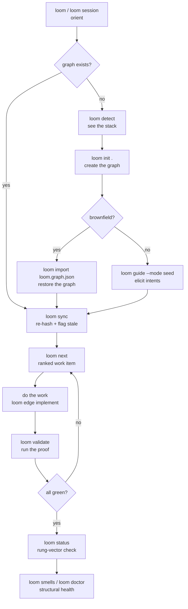

# loom — repo wiki

> Generated OKF v0.1 skeleton by `loom wiki --okf` — do not edit by hand.
> Regenerate after graph changes; `loom wiki --okf --check` verifies freshness.
> The graph is the source of truth; this bundle is a projection of it.
> Companion: `docs/repo-wiki-ladder-proposal.md` — the skeleton an LLM hangs prose on.

## Overview

- **Intents:** 105 (system: 1, component: 21, feature: 83)
- **Domains:** analysis, audit, cli, concurrency, core, db, developer-experience, docs, graph-integrity, health, navigation, operations, repo, static-analysis, sync, teaching, testing, trust, unknown, validation, workflow
- **Layers:** application, cli, graph, persistence, presentation, queries, runtime, test
- **Code files mapped:** 123
- **Quality rules:** 56

## Reading order

A newcomer should read in this order:

1. [Architecture](architecture.md) — the intent hierarchy, top-down.
2. [Components & code](components.md) — intents by domain, grounded in files.
3. [Quality bars](quality.md) — the norms the code is held to.
4. [Glossary](glossary.md) — the bounded `loom vocab` registry.
5. [Design decisions](decisions.md) — `kind=decision` notes with rationale.
6. [Journeys & flows](flows.md) — user-visible intents and their saga proofs.

## Prose layer

Each page carries LLM-authored narrative prose between two HTML-comment
sentinel lines (loom:prose-start / loom:prose-end). It teaches *how the system
fits together* — the cognitive guide the skeleton's flat listings cannot convey.
Certified by `loom wiki --okf --prose-check` (coverage + freshness + consistency);
prose quality is human-gated, never machine-green.

**Permitted in prose:** markdown, fenced code blocks, and mermaid diagrams
(renderable art — their bracket syntax is not read as cross-links). Cite
intents via `[name](intent:uuid)` and codefiles via `[`path`](../src/path)`;
every citation is mechanically checked against the graph.

## Remaining stub

- **Getting started** — build/run validations (not yet implemented; low priority
  because `loom detect` + the architecture page already give a newcomer the
  stack and entry-point facts).

<!-- loom:prose-start -->
## What loom is

loom is a living intent graph for a codebase. Every responsibility the code
fulfils is an intent — a named, criteriated, lifecycle-tracked node — and
every relationship between responsibilities (decomposition, coupling,
governance, validation) is a typed edge. The system intent
[loom: living intent graph CLI](intent:6faa01a5-920a-4231-b840-f4c2057d149b) is the root: a CLI that keeps
the graph and the code in lockstep so the graph is always a faithful model of
what the code actually does.

## How to read this wiki

This wiki is two layers in one artifact. The deterministic **skeleton** above
this prose block is generated by `loom wiki --okf` — frontmatter plus
graph-derived sections that are byte-identical for a given graph, so
`loom wiki --okf --check` guards freshness the way `loom export --check` does.
The **prose** you are reading now is the LLM-authored narrative layer hung on
that skeleton: it teaches *how the system fits together, where to start, and
how a request travels* — the comprehension the skeleton's flat listings cannot
convey on their own.

The prose is falsifiable, not trusted. Three mechanical gates certify it:
**coverage** (every salient intent is cited by at least one page), **freshness**
(every cited codefile's content-hash matches the hash registered in the graph,
so prose about stale code is flagged), and **consistency** (every cross-link
resolves to a real graph node). Prose **quality** — does this actually teach a
newcomer? — stays human-gated and is never machine-green. Run
`loom wiki --okf --prose-check` to certify the mechanical gates.

## Where to start

- New to the codebase? Read [architecture.md](architecture.md) for the layered
  shape, then [components.md](components.md) for the responsibility map.
- Writing a command? [components.md](components.md) names the components; the
  [self-teaching surface](intent:f2995090-ba95-48d3-bb6d-21b4044c32dc) is the guide that tells you
  which lane owns the work.
- On-call for a failure? [quality.md](quality.md) is the quality axis;
  [decisions.md](decisions.md) carries the recorded rulings that explain why
  the code looks the way it does.
- Reviewing a hypothesis? [flows.md](flows.md) traces a request end-to-end,
  including the [hypothesis plane](intent:32b42fd0-6b6c-46a6-a9a8-97be595bddf3) where
  speculation is proven before it touches coverage.

## Coverage ledger

Every salient intent (system, component, and user_visible) must be cited by at
least one prose page. The ledger is the output of the coverage gate; a green
`loom wiki --okf --prose-check` means every name below is anchored to prose.

- [loom: living intent graph CLI](intent:6faa01a5-920a-4231-b840-f4c2057d149b) — the root system intent
- [CLI surface and dispatch](intent:a1a8eb10-bc4c-43d7-a4ec-b7d1fb8d26ae) — the entry point
- [self-teaching surface](intent:f2995090-ba95-48d3-bb6d-21b4044c32dc) — the teaching axis
- [SQLite graph persistence](intent:01783338-7f02-4f4b-8d15-5f396ef7d47d) — the storage axis
- [priority-scored work queues](intent:47c9182c-f7a8-4a50-9281-6d05507e646c) — the work axis
- [completeness and integrity checking](intent:ab4ac603-a14d-4ae4-b68b-a4bf9dce0cb2) — the integrity axis
- [role lanes and evidence gates](intent:20bf582e-df31-4f96-8b37-6171c38e3478) — the governance axis
- [hypothesis plane](intent:32b42fd0-6b6c-46a6-a9a8-97be595bddf3) — the speculation axis
- [external interface surface plane](intent:fcf2f089-6dbe-46f0-8296-d50512420ff8) — the external surface axis

The remaining salient intents are cited from their topical pages
([components.md](components.md), [quality.md](quality.md), [flows.md](flows.md),
[glossary.md](glossary.md)).

## How to drive loom (JIT order)

loom is self-teaching: a cold LLM needs no external docs. The driving protocol is
embedded in the [self-teaching surface](intent:f2995090-ba95-48d3-bb6d-21b4044c32dc)
(`loom guide`, `loom session`, `loom detect`). The just-in-time order — what to
do first, what unlocks what — is:

1. **Orient.** Run `loom` (bare) for orientation, or `loom session` for a
   turn-zero directive. `loom detect` tells you the stack before `loom init`.
2. **Map or import.** Greenfield: `loom init .` then `loom guide --mode seed`.
   Brownfield: `loom init .` then `loom import loom.graph.json`.
3. **Sync.** `loom sync` re-hashes files and flips stale edges to
   `needs_reverification`. Run after any code change.
4. **Find work.** `loom next` returns one ranked item per lane (build, fix,
   validate, quality, discovery, align). `loom next --all` shows every queue.
5. **Execute.** Do the work the item describes. Ground it: `loom edge implement`.
6. **Prove.** `loom validate` runs the proof. `loom validate --all` drains
   pending proofs.
7. **Check.** `loom status` for the rung-vector. `loom smells` for structural
   findings. `loom doctor` for schema conformance.

Every box is a loom command — no external tooling, no docs to read. The
[role lanes and evidence gates](intent:20bf582e-df31-4f96-8b37-6171c38e3478) gate
every transition: a builder records a verdict, a validator seeds a rule, so the
graph is append-only-auditable.

<!-- loom:prose-end -->
